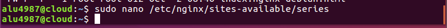
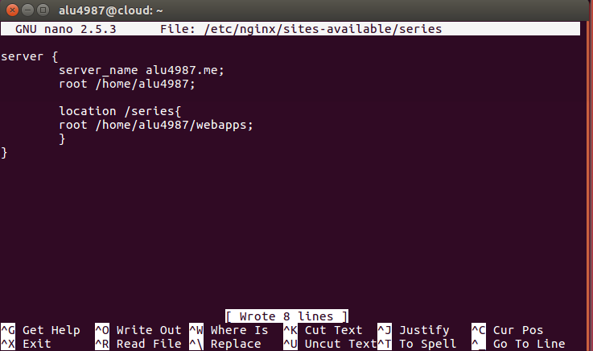
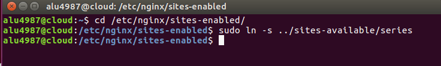

# UT1-A1 Mis Series Favoritas

### Preparación

Crear una pagina web en el dominio aluxxxx.me y configurar nginx , para crear un virtual host llamo series y en el colgar la pagina en dicha carpeta del dominio

### Creando el archivo Series

Abrimos el terminal y vamos a la ruta "/etc/nginx/sites-availables" y cremoa la carpeta.

Utilizamos el comando sudo ya que las carpetas son
privilegiadas y no pueden acceder cualquier usuario.

### Configurar el archivo series

Editamos el archivo series, para cuando nosotros accedamos a aluxxxx.me/series nos redireccione a la pagina que hemos diseñado usamos la directiva location.

### Enlazar el archivo series

Tenemos que enlazar el archivo en la ruta "/etc/nginx/sites-enabled"
para que este habilitado.

Para ello usamos el comando ln -s para crear un enlace simbolico y redireccionar al archivo

###
