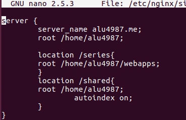
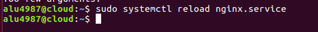

# UT1-A2: Listado de directorios

## Preparación

Se creara una carpeta cuyo contenido son enlaces simbolicos que apuntan archivos del sistema,
se configura el archivo "sites-available" para poner un nueva localización.

###Creación de la carpeta y enlaces

Abrimos al terminal, entramos en nuestro dominio, vamos al "/home/aluxxxx" creamos la carpeta "Shared"

Ahora creamos dentro de la carpeta los enlaces simbolicos.

 

 Comprobamos que los enlaces se crearon bien

 

### Crear la localización

Vamos al archivo /sites-available y añadimos la nueva localización

Añadimos el autoindex para que nos cree un indice al acceder desde el navegador.

> Cuando se cambia algo en estos archivos siempre tenemos que hacer un reload del nginx

### Comprobación 

Abrimos el navegador y comprobamos que si cargo la configuracion del servidor

