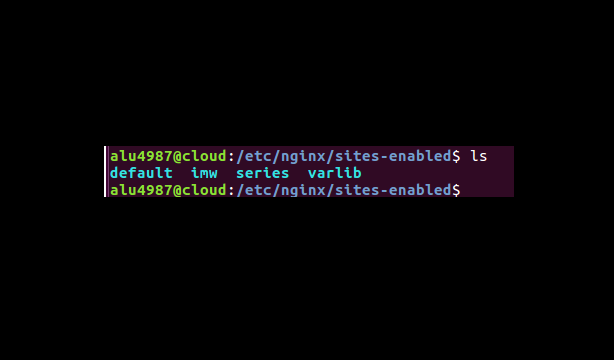
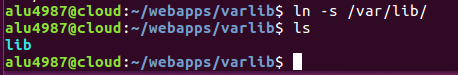

### Preparación

Crear cuatro sitios (virtual host) para nuestro servidor.

* Sitio Web 1 : Descargar un diagrama de las unidades , subirlo a nuestro servidor y que se muestre en la pagina

>imw.alu4987.me

  Y dentro de imw crear una carpeta llamada "mec" que muestre el Real Decreto de Administración de Sistemas en Red

>imw.alu4987.me/mec

* Sitio Web 2 : Mostrar ficheros y directorios de var/lib por el puerto 9000

>varlib.alu4987.me:9000

* Sitio Web 3 : En este sitio web utilizaremos certificado (ssl) y un usuario para que cuando acceda a la pagina le pida una contraseña y se muestre un listado de alumnos.

>ssl.alu4987.me/students

* Sitio Web 4 : Es rediregir cualquier peticion a nuestro dominio a la pagina:

>target.alu4987.me

### Sitio Web 1

Abrimos el terminal y creamos la carpeta imw.

Y dentro de imw la carpeta mec.

Creamos una carpeta llamada imw/img para almacenar el diagrama de trabajo y subimos el archivo a nuestro dominio

Dentro de imw almacenamos el archivo index.html

Y en imw/mec colocamos otro index.html

Ahora vamos a la ruta "**/etc/nginx/sites-available**" esta ruta es para los sitios disponible

> Y dentro de ruta creamos un archivo llamado imw que contiene:
~~~
 Server {
  server_name imw.alu4987.me
  root /home/alu4987/webapps/imw
  location /mec{
  root /home/alu4987/webapps/imw
  }
}
~~~

Una vez terminado vamos a la ruta /etc/nginx/sites-enable y creamos un enlace simbolico; esta ruta para sitios web habilitados.

Comprobamos en un navegador entrando en <http://imw.alu4987.me> para el diagrama y en <http://imw.alu4987.me/mec> para el BOE

### Sitio Web 2

Abrimos el terminal creamos la carpeta varlib

Creamos un enlace simbolico dentro de varlib apuntando a la ruta "**/var/lib**"

Vamos a la ruta "**/etc/nginx/sites-available**" y creamos el archivo varlib, escuchando al puerto 9000 y con un autoindex.

Habilitamos el sito web en /etc/nginx/sites-enable y hacemos el enlace simbolico.

Hacemos un reload para cargar la nueva información

Abrimos un navegador y comprobamos si funciona correctamente <http://varlib.alu4987:9000>

### Sitio Web 3

Creamos la carpeta ssl

Dentro de la carpeta ssl creamos el directorio students

Creamos una contraseña cifrada con leguaje Perl

Y hacemos un echo con el usuario y la contraseña apuntando a "**.htpasswd**", que se creara automaticamente , ese archivo esta en "**students**"

> Corrección en vez admin es usuario1

Corregido

Vamos a la ruta de sitios web disponible "**/etc/nginx/sites-available**" y creamos el archivo "ssl"

Ahora creamos el enlace simbolico en sitos web habilitados "**/etc/nginx/sites-enable**"

Y hacemos un reload para volver a cargar la configuración nueva

Abrimos el navegador y comprobamos <http://ssl.alu4987.me/students>

### Sitos Web 4

Creamos la carpeta redirect y dentro una carpeta llamada target

Subimos un archivo zip al dominio

Hacemos un unzip

> Metemos el contenido en la carpeta target

Ahora vamos a la ruta "**/etc/nginx/sites-available**" y creamos el archivo target

Creamos el enlace simbolico para habilitar la pagina **/etc/nginx/sites-enable**

Creamos la carpeta redirect en la ruta **/var/log/nginx** para que almacene todos los errores o accesos a la pagina redireccionada.

Hacemos un reload de nuestro dominio para cargar la nueva configuracion

Comprobamos con el comando "**systemctl status nginx.service**" para ver si cargo bien toda la configuración.

Ahora comprobamos abriendo un nevegador a ver si nos redirecciona a la pagina de la configuración

<http://redirect.alu4987.me/test>
<http://www.redirect.alu4987.me/probando>
<http://www.redirect.alu4987.me/hola>

