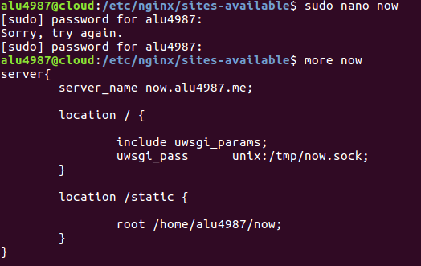
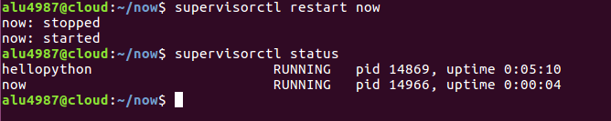

# Aplicaciones Php y Python

* ## PHP

  * Creamos la carpeta PHP en ``mkdir /home/alu4987/PHP``
  * Subimos al servidor una pagina en php con el comando "**SCP**"

  

  * Utilizamos el comando unzip para descomprimir el archivo.

  

  * Vamos a la ruta ``/etc/nginx/sites-available`` y cremos un virtual host llamado php.

  

  * Creamos un enlace simbolico en ``/etc/nginx/sites-enable`` para habilitar el virtual host.

  

  * Hacemos un reload del servicio ``systemctl reload nginx.service`` y comprobamos en un navegador si funciona la pagina.

  

* ## Python

  * Creamos una carpeta llamada "**now**" en la ruta ``/home/alu4987``

  

  * Ahora creamos un entorno virtual para nuestras aplicaciónes.

  

  * Activamos el entorno virtual para trabajar con el.

  

  * Dentro del entorno instalamos con "**PIP**" ,"**UWSGI**" y "**FLASK**"

  

  

  * Creamos la app llamada ""**main.py**""

  

  * Ahora vamos a crear un nuevo virtual host llamado "**now**" ``en /etc/nginx/sites-available`` y creamos el enlace simbolico en ``/etc/nginx/sites-enable`` para habilitar.

  

  

  * Ahora entramos en el entorno virtual y ejecutamos el proceso para escuchar peticiones para nuestra app ``uwsgi --socket 0.0.0.0:8080 --protocol=http -w main:app``

  

  * Comprobamos en el navegador <http://now.alu4987.me>

  

* ## Configuración del servidor web uWSGI

  * Configuramos el servidor web uwsgi, creando un fichero "**uwsgi.ini**" que sera el encargado de ejecutar la app.

  

  * Ahora creamos un pequeño script llamado "**run.sh**" que se encarga de activar nuestro entorno virtual de nuestra aplicación y ejecuar el uwsgi.ini.

  

  * Le damos permiso de ejecución al script.

  

  * Hacemos un reload del servidor para que carge la nueva información.

  * Ejecutamos el script y comprobamos en el nevegador que se esta ejecutando la aplicación.

  

  

* ## Supervisor

  * Usaremos una herramienta de cordinador de procesos "**Supervisor**" que se encarga de mantener activa nuestra aplicación.

  * Creamos una configuración para supervisor para que cordine nuestra app.

  

  * Ahora hacemos un restart de supervisor para que carge la nueva configuración y comprobamos que esta activa.

  

  * Comprobamos que esta activa nuestra aplicación accediendo por el navegador.

  

  * Hacemos un ``supervidorctl stop now``.

  

  * Comprobamos y si la aplicación no esta funcionando.

  

  * Volvemos a activarlo ``supervidorctl start now``.

  

  * Comprobamos que funciona.

  

  * Hacemos ``supervidorctl restart now`` y volvemos a comprobar que funciona perfectamente.

  

  
