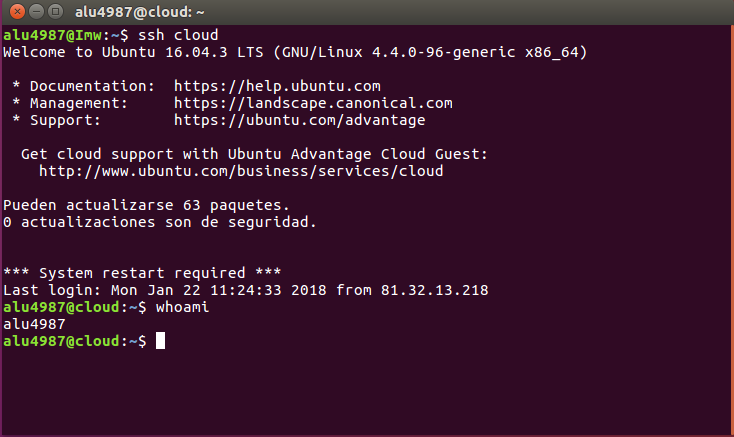
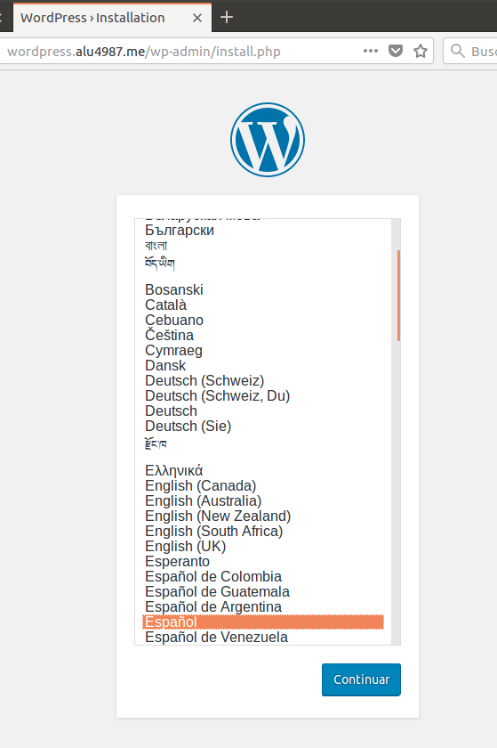
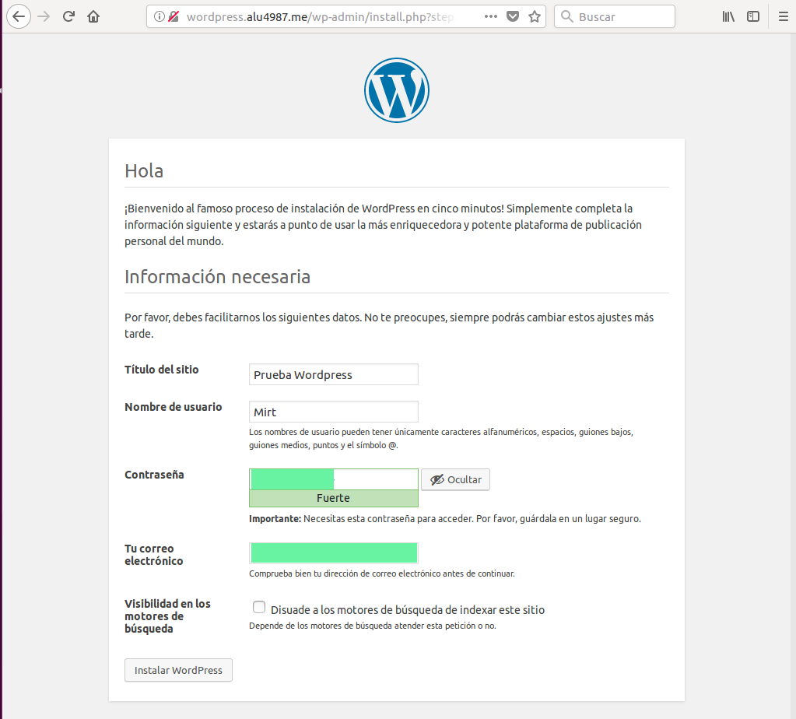

# Instalación de Wordpress y Configuración basíca.

### Acceso a la maquina de produccion.

Vamos al terminal y accedemos a la maquina de produccion vía **ssh**

### Creación de base de datos.

Wordpress necesita un usuario/contraseña para acceder a la base de datos. Usaremos **MySQL**.

Creamos la base de datos, el usuario y sus privilegios:

### Descarga de código de Wordpress.

Vamos al terminal y con el comando ``curl -O https://Wordpress.org/latest.zip`` descargamos el código fuente de Wordpress.

Descomprimimos el código y lo copiamos en la ruta ``/usr/share``

Ahora vamos a dar permiso a www-data para que pueda usar estos ficheros.

> Usamos servidor web Nginx por eso le tenemos que dar los permiso a www-data.

### Configurar fichero de Wordpress.

Vamos a especificar el nombre de la base de datos, el usuario y contraseña, para que Wordpress lo pueda usar.

> Usamos el fichero que nos da Wordpress como plantilla.

Modificamos el líneas siguientes.

### Acceso mediante Nginx

Para poder acceder a nuestro sitio Wordpress desde un navegador Web , necesitamos incluir directivas necesarias en nuestro servidor web **Nginx**

Vamos a utilizar como acceso a Wordpress desde la url ``wordpress.alu4987.me``. Para ello creamos un nuevo host virtual.

Ahora enlazamos el host virtual para que este disponible:

Recargamos nuestro servidor para que los cambios se hagan efectivos.

### Configuración de Wordpress vía web.

Accedemos mediante un nevegador Web ,con la direccion de nuestro sitio web ``http://wordpress.alu4987.me``.

Elegimos el idioma y le damos a **Continuar**.

Rellenamos los campos y **Instalar Wordpress**

Pulsamos **Acceder** y iniciamos sesion.

Y tenemos acceso a la interfaz de Wordpress.

### Ajustes de Permalinks

En el panel administrativo de Wordpress, vamos a ajustes => Enlaces permanentes.

Y seleccionamos el ajuste de **Dia y Nombre**. y Guardamos cambios.

Ahora vamos a nuestro servidor web y indicamos a Nginx que procese estas URL:

> Esta linea que añadimos es para procesar los Permalinks.

Recargamos nuestro servidor para que los cambios se hagan efectivos.

> De esta manera podemos acceder a nuestro panel administrativo mediante http://wordpress.alu4987.me/admin

### Límite de tamaño en la subida de archivos.

Por defecto, el límite de subida de archivos para aplicaciones PHP suele ser bastante bajo, en torno a los 2MB.

Para incrementarlo, debemos modificar las siguientes líneas.

Reiniciamos el servicio phph-fm.

Y añadimos el la línea ``client_max_body_size 64M;`` en el fichero ``nginx.conf``

Recargamos el servidor.

### Creamos el primer post.

Vamos al panel administrativo y seleccionamos **Añadir nueva** y creamos nuestro post.

Pulsamos en Actualizar para que se hagan efectivos los cambios.

