# UT5-A2: Plugins de Wordpress

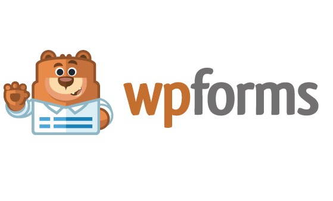

### 1.Descripción.
Wordpress no incluye esta herramienta de forma nativa, pero exixten Plugins, que nos facilita crear formularios de una forma sencilla y muy visual como es en este caso WPForms.
### 2.Facilidad de instalación/activación (1 a 5).

Es un Plugin facil de instalar, parte del software es gratuito.

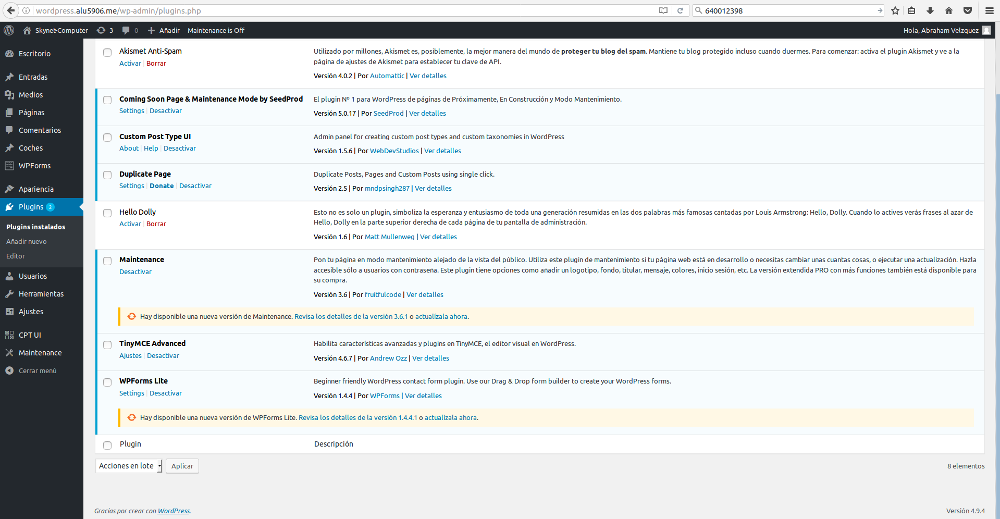

Una vez activado nos aparece en nuestro manu lateral.

El costo del software completo, si queremos utilizar las demas plantillas.

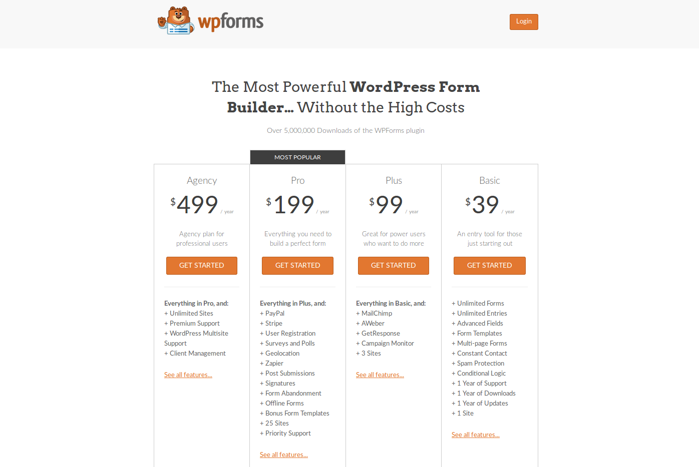

### 3.Facilidad de uso (1 a 5).

Es una herramienta muy intuitiva que se compone de 5 apartados.

* Setup

   En este apartado podemos poner nombre a nuestra plantilla y elegir entre tres **templates** que dispone la version gratuita; estos templates son:

    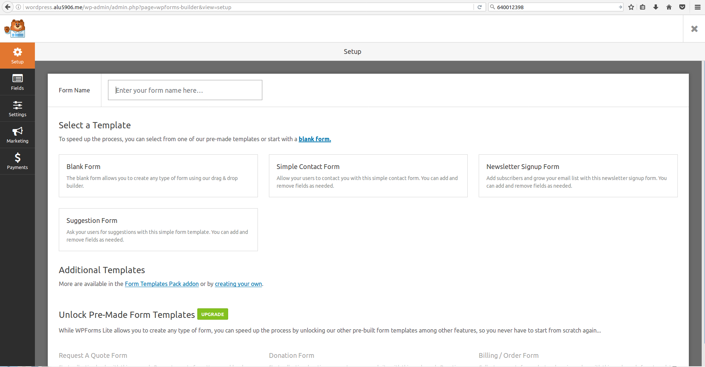

* Black Form:

  Es un formulario en blaco para deseñar uno a tus necesidades.

  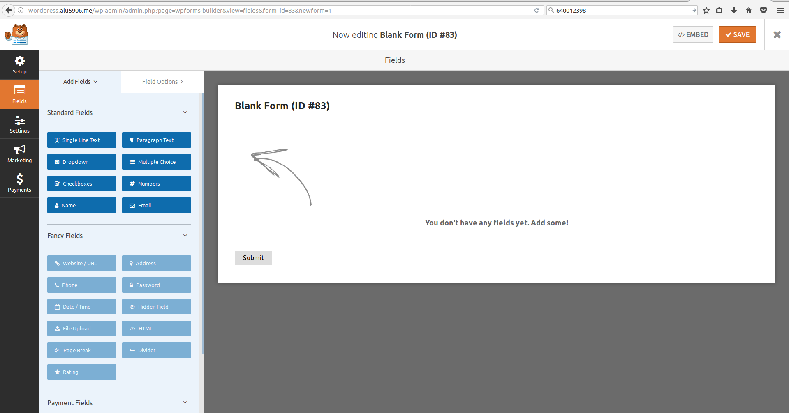

* Simple Contact Form:

  Es un formulario de contacto simple.

  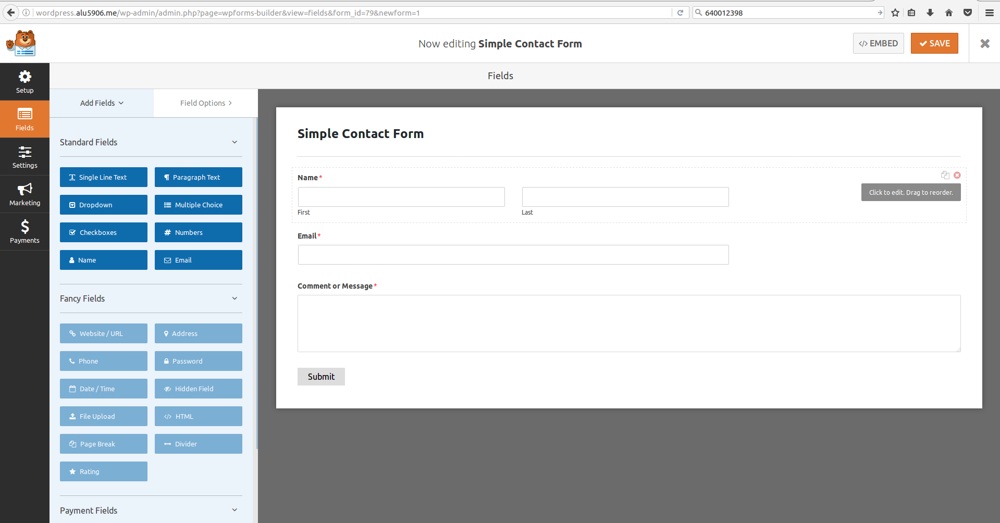

* Suggestion Form:

  Es lo mismo que el anterior lo que le añade poder añadir sugerencia y enviarlo a un departamento.

  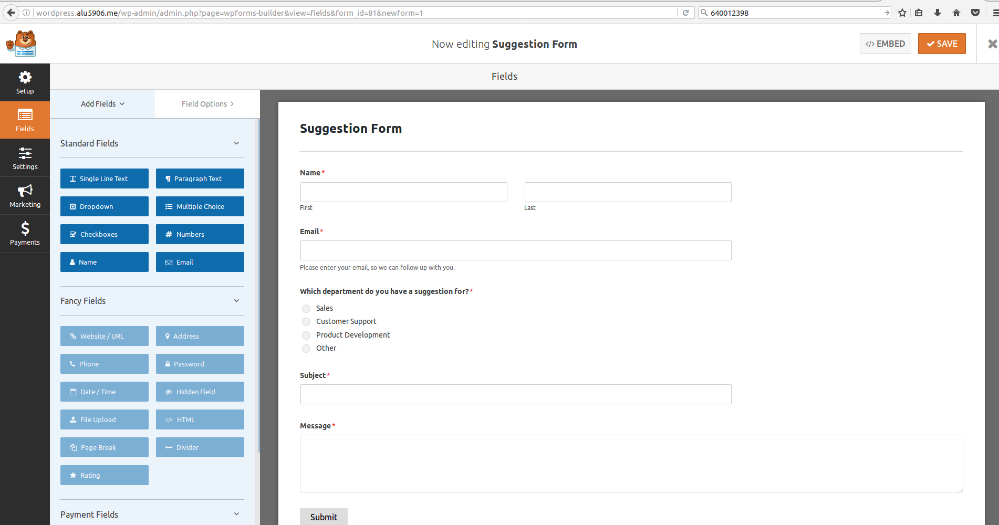

* Newsletter Signup Form:

  Este formulario lo utilizamos para crear nuevos ususarios, con campos como nombre , apellidos y el email.

  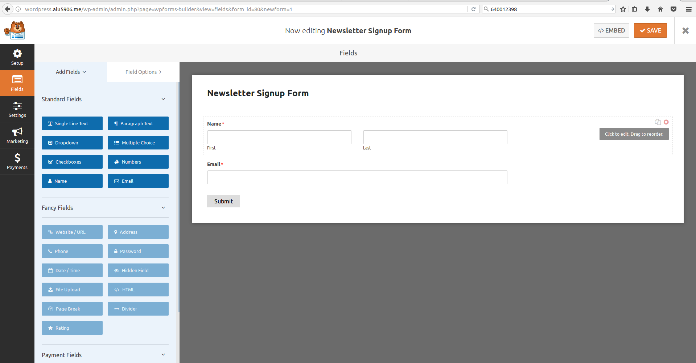

> En la creacion de formulario con solo arrastrar elementos nuevos de la parte lateral izquierda al formulario, añadimos nuevos elementos a el.

* Fields

  En fields podemos editar cada uno de los Widget que tenemos en el formulario con solo pulsar en el podemos cambiar los nombres de ellos, su formato, y poner un descripción.

  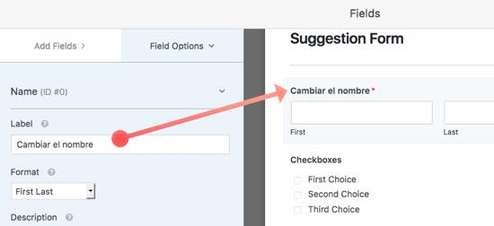

* Settings

  Una vez finalizado el formulario, podemos ir a opciones y configurar el nombre del formulario, los botones de texto que tambien lo puedes hacer antes, añadir una descripción.

  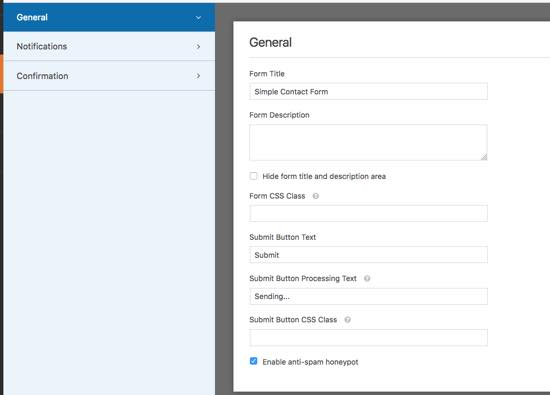

  Tambien podemos configurar un sistema de notificación, que tiene una similitud a los tags que podemos cambiar el asuston del mail enviado.

  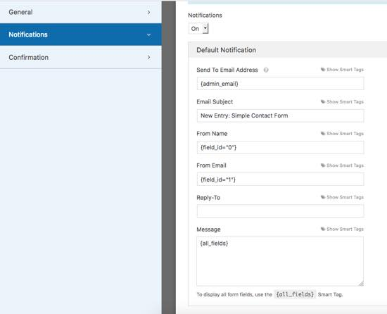

  Y por ultimo , madar un mensaje por si alguien rellena el formulario, enviar un email indicando que esta todo correcto.

  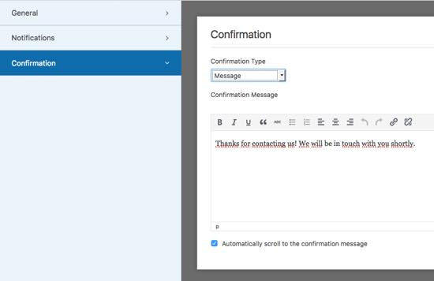

* Marketing
* Payments

> Las opciones de Marketing y Payments son de pago y no puedo mostrarlas.

### 4.Utilidad (1 a 5).

  En mi opinion personal , es una herramienta que te puede facilitar el crear formularios rapidos, funcionables y personalizables, es una herramienta muy util.

### 5.Tipo de páginas en las que sería útil.

  Hoy en dia, una pagina siempre tiene un apartado de formulario , sea para feedback, para reporte de algun bug, para ponerse en contacto con la pagina, etc, diria en casi todas.

### 6.Widgets asociados.
### 7.Requerimientos/Dependencias.
